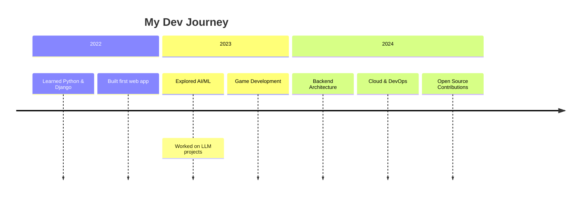

# 🚀 Welcome to My Digital Universe

<div align="center">
  
</div>

<div align="center">
  
  
  
  
</div>

---

## 👨‍💻 About Me

<table>
  <tr>
    <td width="60%">
      
### 🌟 Backend Architect & ML Explorer

```python
class Agnik:
    def __init__(self):
        self.name = "Agnik Roy"
        self.role = "Backend Developer"
        self.location = "India 🇮🇳"
        self.languages = ["Python", "Go", "C#", "JavaScript", "SQL"]
        self.current_focus = ["MLOps", "System Architecture", "RAG Pipelines"]
        self.passion = "Building scalable systems that matter"
    
    def daily_routine(self):
        return [
            "☕ Coffee with code",
            "💻 Architect solutions", 
            "🧠 Learn new tech",
            "🚀 Build & deploy",
            "🔄 Repeat"
        ]
    
    def get_life_motto(self):
        return "Code with purpose, build with passion! 🚀"
```

### 🎯 What I Do
- 🏗️ **Architecture**: Designing scalable backend systems with microservices
- 🤖 **AI/ML**: Fine-tuning LLMs and building RAG systems  
- 🔧 **DevOps**: Docker, CI/CD, and cloud deployments (AWS/GCP)
- 📊 **Data Engineering**: Building efficient data pipelines
- 🎮 **Game Dev**: Creating immersive experiences with Unity

    </td>
    <td width="40%">
      
      
### 🌐 Connect With Me
<div align="center">

[](https://www.linkedin.com/in/agnik-roy-3a4434258/)
[](mailto:ar12agnik@gmail.com)
[](https://twitter.com/agnikroy12)
[](https://www.codechef.com/users/ar12agnik)
[](https://leetcode.com/u/ar12agnik/)
[](https://discordapp.com/users/ar12agnik)

</div>

### 🎮 Currently Playing
<div align="center">
  


</div>
    </td>
  </tr>
</table>

---

## ⚡ Tech Arsenal

<div align="center">

### 🔥 Languages & Core

<p align="center">
  
  
  
  
  
  
</p>

### 🌐 Frameworks & Libraries

<p align="center">
  
  
  
  
  
  
</p>

### 🗄️ Databases

<p align="center">
  
  
  
  
  
</p>

### ☁️ Cloud & DevOps

<p align="center">
  
  
  
  
  
</p>

### 🤖 AI/ML Stack

<p align="center">
  
  
  
  
  
</p>

### 🛠️ Tools & Platforms

<p align="center">
  
  
  
  
  
</p>

</div>

---

## 📊 GitHub Analytics

<div align="center">


</div>

<table>
  <tr>
    <td width="50%">
      
    </td>
    <td width="50%">
      
    </td>
  </tr>
</table>

<div align="center">
  
</div>

---

## 📈 Activity & Contribution

<div align="center">
  
</div>

<div align="center">
  
</div>

---

## 🌟 Featured Projects

<div align="center">

### 🏆 Highlighted Repositories

[](https://github.com/ar12agnik/silk_road-college-project)
[](https://github.com/ar12agnik/url-shortner)

[](https://github.com/ar12agnik/passvolt)
[](https://github.com/ar12agnik/Project-P3-dashboard)

</div>

---

## 🎯 Current Focus

<table>
  <tr>
    <td width="50%">
      
### 🚀 **2024 Goals**
- [x] 🤖 Build production RAG system
- [ ] ☁️ AWS Solutions Architect Certification
- [ ] 🔧 Contribute to Open Source Projects
- [ ] 📝 Start Technical Blogging
- [ ] 🏗️ Build Microservices Architecture
- [ ] 🦀 Learn Rust for systems programming

### 📊 **Metrics Tracking**
```python
goals_2024 = {
    "certifications": ["AWS SA", "Kubernetes"],
    "projects": 5,
    "open_source_contributions": 10,
    "blogs_published": 12,
    "languages_learned": ["Rust", "Terraform"]
}
```

    </td>
    <td width="50%">
      
### 📚 **Learning Queue**
- 🦀 **Rust** - Systems Programming
- ☁️ **AWS/GCP** - Cloud Platforms
- 🔄 **Kubernetes** - Container Orchestration
- 📊 **Apache Kafka** - Event Streaming
- 🧠 **PyTorch** - Deep Learning
- 🏗️ **Terraform** - Infrastructure as Code

### 📖 **Recent Reads**
- "Designing Data-Intensive Applications" by Martin Kleppmann
- "Clean Architecture" by Robert C. Martin
- "The Pragmatic Programmer" by Andrew Hunt

    </td>
  </tr>
</table>

---

## 💡 Fun Facts & Dev Insights

<div align="center">

```javascript
const agnikFacts = {
    coffeeConsumption: "☕ 4-5 cups daily (fuel for coding)",
    debuggingTechnique: "🐛 I talk to rubber ducks",
    codingMusic: "🎵 Lo-fi beats while coding",
    superpower: "🔍 Finding bugs at 3 AM",
    motto: "💡 Code today, automate tomorrow!",
    favoriteEditor: "VS Code with Dracula theme",
    terminal: "Zsh with Powerlevel10k",
    setup: "Dual monitor + Mechanical keyboard"
};
```

### 🎵 Currently Coding To
[](https://open.spotify.com/user/ar12agnik)

</div>

---

## 📆 Development Timeline



---

## 🤝 Let's Collaborate!

<div align="center">

### 💬 **Always Open to Discussing:**
🚀 **Backend Architecture** • 🤖 **AI/ML Projects** • 🔧 **System Design** • 📊 **Data Engineering** • 🎮 **Game Development**

<br>

**💭 "Great things are built by great teams. Let's build something amazing together!"**

<br>

[](mailto:ar12agnik@gmail.com)
[](https://www.linkedin.com/in/agnik-roy-3a4434258/)
[](https://calendly.com/ar12agnik)

</div>

---

<div align="center">

### ⚡️ Quick Stats

| | |
| :--- | :--- |
| **Total Contributions** |  |
| **Lines of Code** |  |
| **Projects Completed** |  |
| **Coffee Consumed** |  |

</div>

---

<p align="center">
  
</p>

<p align="center">
  <strong>⭐ Star some repositories if you find them interesting!</strong>
</p>

<p align="center">
  
</p>

<div align="center">
  
Made with ❤️ and ☕ by Agnik Roy

</div>
